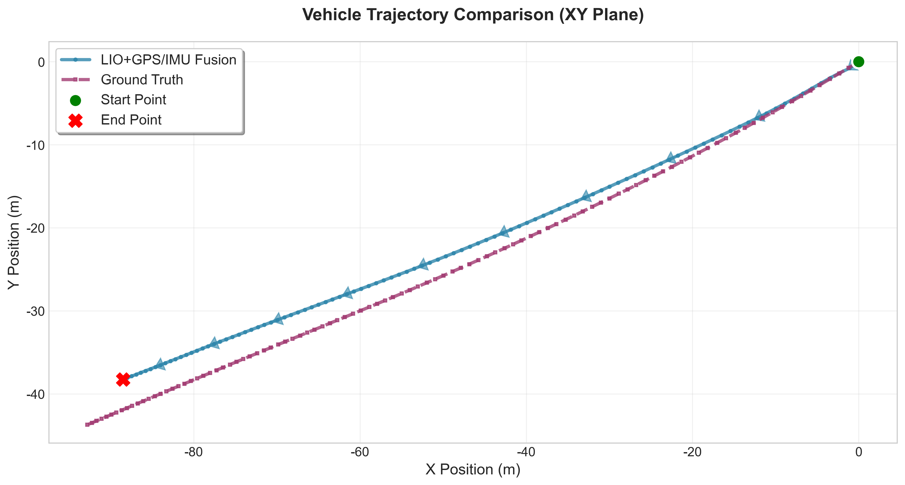
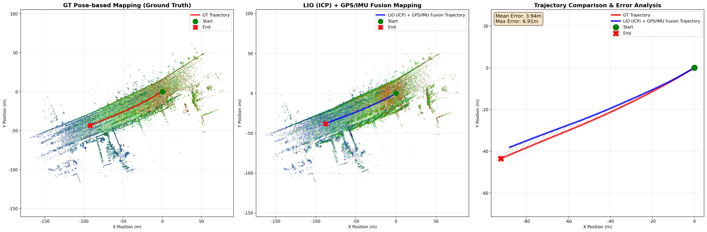
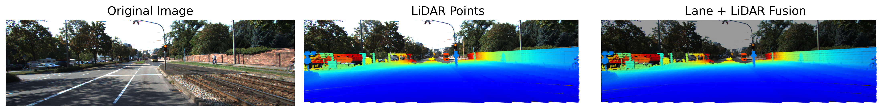
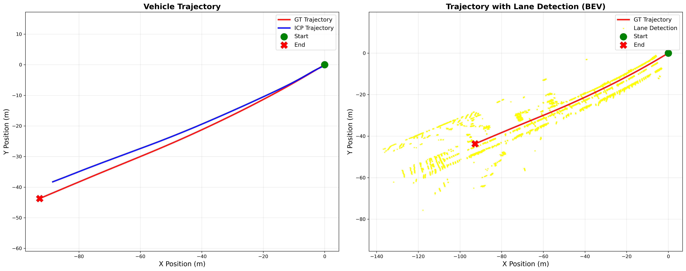
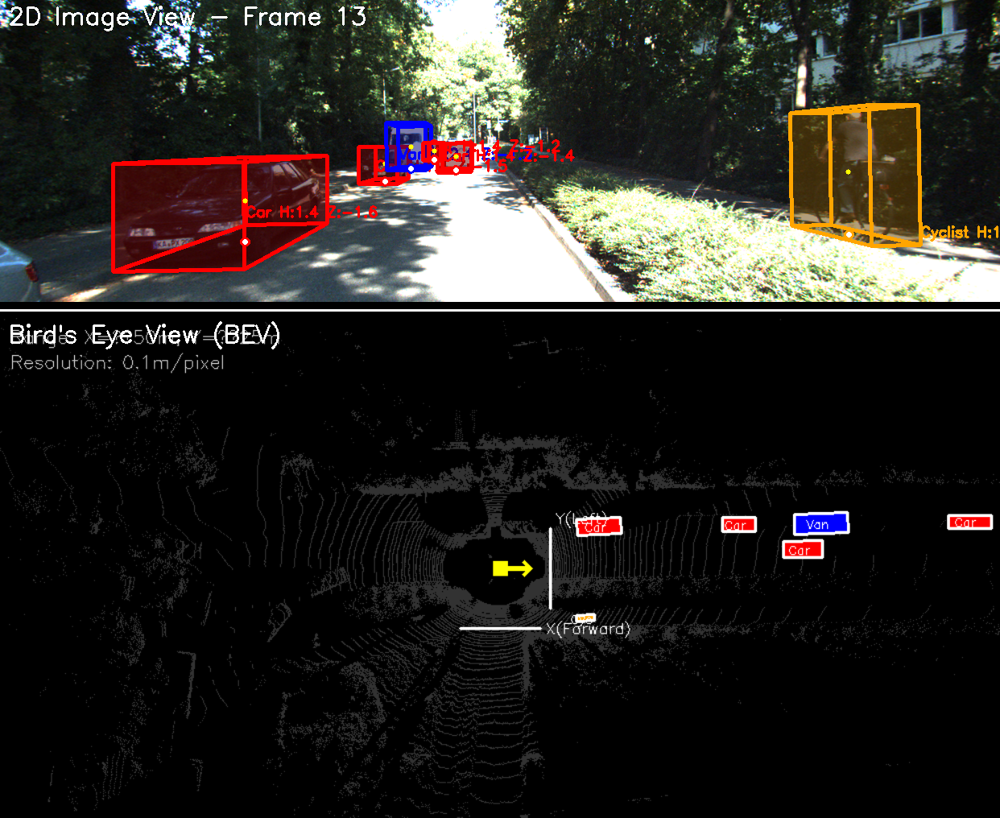
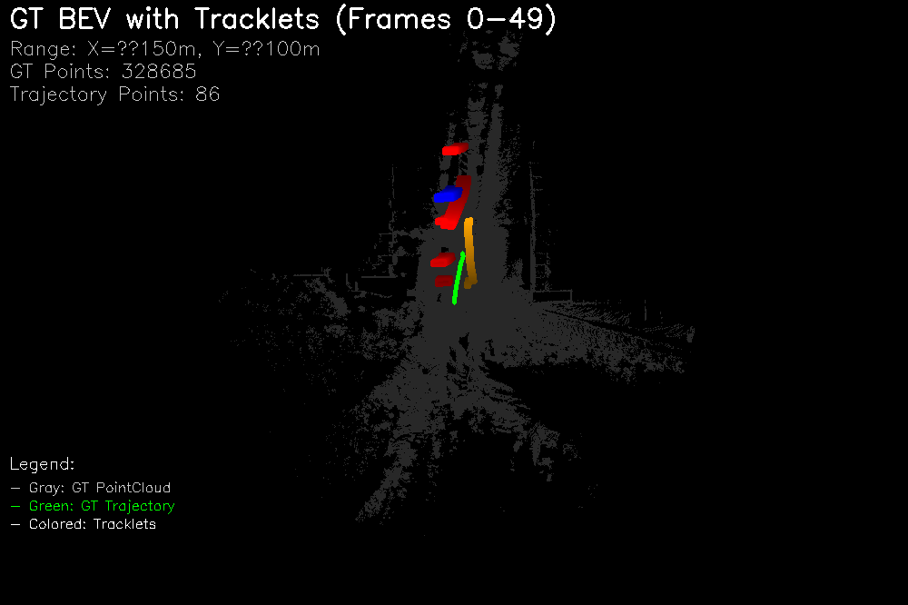

# KITTI HD Map Generation Pipeline - Prototype 🗺️

**정밀 지도 생성 파이프라인 학습용 코드**

본 프로젝트는 KITTI 데이터셋을 기반으로 자율주행 기술의 핵심인 **정밀 지도(HD Map) 생성 파이프라인**의 일부를 간단하게 구현해보는 학습용 코드입니다.
상용 수준의 고정밀 성능을 지향하기보다는, 전체적인 처리 흐름과 각 구성 요소의 역할을 이해하는 데 초점을 맞추고 있습니다.
센서 데이터 분석부터 Ego-Pose 추정, 포인트 클라우드 정합, 차선 시맨틱 추출까지 전체 파이프라인을 단계적으로 학습할 수 있습니다.

> **참고**: 실제 HD Map 생성 파이프라인은 `Data Collection & Pre-processing` → `Point Cloud Registration & Mapping` → `Semantic Object Detection` → `Topology Extraction & HD Map Structuring` → `Map Optimization & Standard Format Conversion` → `Automated Change Detection & Map Update` 와 같이 구성되지만, 본 프로젝트에서는 raw 데이터를 활용하여 Ego-pose와 trajectory를 구하고 point cloud를 정합한뒤 lane을 검출하여 3D 공간상에 투영하는 기본적인 단계만 구현합니다.

## 📋 목차
- [개요](#-개요)
- [주요 구성 요소](#-주요-구성-요소)
- [설치 및 환경 설정](#-설치-및-환경-설정)
- [데이터셋 준비](#-데이터셋-준비)
- [사용법](#-사용법)
- [결과 예시](#-결과-예시)
- [시스템 아키텍처](#-시스템-아키텍처)

## 🎯 개요

본 프로젝트는 자율주행 차량의 정밀 지도 생성을 위한 세 가지 핵심 기술을 학습할 수 있도록 구성되었습니다:

1. **KITTI Dataset Analysis**: KITTI raw 데이터셋 분석
2. **Ego-Pose Estimation**: 차량의 위치와 자세 추정
3. **Point Cloud Registration**: 3D 포인트 클라우드 정합 및 맵핑
4. **Lane Segmentation**: 차선 검출 및 분할

각 모듈은 독립적으로 실행 가능하며, 전체 파이프라인을 통해 KITTI 데이터로부터 기본적인 정밀 지도를 생성할 수 있습니다.

## 🛠️ 주요 구성 요소

### 1. KITTI Dataset Analysis (`kitti_dataset_analysis.ipynb`)
- **목적**: KITTI raw 데이터셋의 기본 구조 이해 및 센서 데이터 간 관계 분석
- **주요 분석 내용**:
  - 카메라 이미지 확인 및 시각화
  - LiDAR 포인트 클라우드 데이터 확인
  - 포인트 클라우드 다중 프레임 정합 및 OXTS (GPS/IMU) 데이터를 활용한 프레임별 ego-pose 추정 및 trajectory 시각화
  - 캘리브레이션 데이터를 활용한 LiDAR 포인트의 이미지 평면 투영 및 시각화

### 2. Ego-Pose Estimation (`kitti_ego_pose_estimation.py`)
- **목적**: LiDAR + GPS/IMU 센서 융합을 통한 차량 위치(ego-pose) 추정
- **알고리즘**: Extended Kalman Filter 기반 센서 퓨전
- **출력**: 프레임별 차량 위치 및 궤적 (trajectory)

### 3. Point Cloud Mapping (`kitti_point_cloud_registration.py`)
- **목적**: 연속된 LiDAR 스캔의 3D 정합을 통한 포인트 클라우드 맵 생성
- **알고리즘**: ICP (Iterative Closest Point) 기반 포인트 클라우드 정합
- **출력**: 통합된 정밀 3D 포인트 클라우드 맵

### 4. Lane Segmentation (`kitti_lane_segmentation.py`)
- **목적**: 카메라 이미지 기반 차선 검출 및 3D 공간 투영
- **알고리즘**: 밝기 기반의 단순한 차선 검출 + LiDAR 융합 (딥러닝 X)
  - 참고: 간단한 thresholding 기반으로 구현되며, 딥러닝 기반 차선 검출 및 후처리 도입 시 정밀도 향상 가능
- **출력**: 차선 검출 결과 및 BEV 시각화

### 5. Tracklets Visualization (`kitti_tracklets_visualization.py`)
- **목적**: KITTI tracklets 데이터를 활용한 객체 어노테이션 시각화
- **주요 기능**:
  - 2D 이미지에 3D bbox 투영 및 시각화
  - 프레임별 포인트 클라우드 BEV에 객체 bbox 표시
  - GT 포인트 클라우드 맵에 다중 프레임 객체 어노테이션 누적
  - 객체 타입별 색상 구분 및 투명도 기반 시간 순서 표현
- **출력**: 
  - 2D + BEV 결합 이미지
  - GT 포인트 클라우드 기반 전체 프레임 객체 시각화

## 📦 설치 및 환경 설정

### 필요 라이브러리

```bash
pip install numpy matplotlib opencv-python open3d scipy scikit-image filterpy pillow pathlib
```

## 💾 데이터셋 준비

KITTI 데이터셋을 다음과 같은 구조로 준비하세요:

```
KITTI_dataset/
├── calibration/
│   └── 2011_09_26_drive_0001/
│       ├── calib_cam_to_cam.txt
│       └── calib_velo_to_cam.txt
├── data/
│   └── 2011_09_26_drive_0001_sync/
│       ├── image_02/data/
│       ├── velodyne_points/data/
│       └── oxts/data/
└── tracklets/
    └── 2011_09_26_drive_0001_sync/
        └── tracklet_labels.xml
```

### KITTI 데이터셋 다운로드
1. [KITTI 공식 웹사이트](https://www.cvlibs.net/datasets/kitti/raw_data.php)에서 다음 데이터를 다운로드
- 상단 메뉴의 'raw data' - 'Select category'에서 원하는 카테고리 고르고 일부 데이터만 다운로드 가능
- 각 카테고리별로 다양한 주행 환경의 데이터셋 제공
  - Raw data (synced+rectified)
  - Calibration data
  - Tracklets data (object annotations)

## 🚀 사용법

### 1. Ego-Pose Estimation

```bash
python kitti_ego_pose_estimation.py --base_path KITTI_dataset --dataset_prefix 2011_09_26 --max_frames 100
```

**출력 파일:**
- `results/2011_09_26/kitti_trajectory_*.png`: 궤적 비교 그래프
- `results/2011_09_26/kitti_poses_*.pkl`: 계산된 pose 데이터

### 2. Point Cloud Mapping

```bash
python kitti_point_cloud_mapping.py --base_path KITTI_dataset --dataset_prefix 2011_09_26 --pose_file results/2011_09_26/kitti_poses_*.pkl
```

**출력 파일:**
- `results/2011_09_26/kitti_*_pointcloud.pcd`: 3D 포인트 클라우드 맵
- `results/2011_09_26/kitti_point_cloud_comparison_2d_*.png`: 2D 비교 시각화

### 3. Lane Segmentation

```bash
python kitti_lane_segmentation.py --base_path KITTI_dataset --dataset_prefix 2011_09_26 --pose_file results/2011_09_26/kitti_poses_*.pkl
```

**출력 파일:**
- `results_lane/2011_09_26/kitti_lane_detection_frame*_*.png`: 프레임별 차선 검출 결과
- `results_lane/2011_09_26/kitti_trajectory_lanes_*.png`: BEV 차선 맵

### 4. Tracklets Visualization

```bash
python kitti_tracklets_visualization.py --base_path KITTI_dataset --dataset_prefix 2011_09_26 --max_frames 50
```

**출력 파일:**
- `results_tracklets/2011_09_26/combined_frame*.png`: 2D + BEV 결합 이미지
- `results_tracklets/2011_09_26/gt_bev_with_tracklets_*.png`: GT 포인트 클라우드 기반 전체 프레임 객체 시각화

## 📊 결과 예시

### 1. 차량 궤적 추정

*GPS/IMU와 LiDAR ICP 융합을 통한 차량 궤적 추정 결과*

### 2. 3D 포인트 클라우드 맵

*Ground Truth vs ICP 기반 포인트 클라우드 맵 비교*

### 3. 차선 검출 결과

#### 프레임별 차선 검출
<div align="center">


</div>

*프레임 0과 30에서의 차선 검출 결과 (ROI, 밝기 임계값, 차선 오버레이)*

#### LiDAR-카메라 융합

*LiDAR 포인트와 차선 검출 결과의 융합 시각화*

#### Bird's Eye View 차선 맵

*차량 궤적과 검출된 차선의 BEV 통합 시각화*

### 4. 객체 어노테이션 시각화

#### 2D + BEV 결합 시각화

*2D 이미지와 BEV의 결합 시각화 (3D bbox 투영 및 포인트 클라우드)*

#### GT 포인트 클라우드 기반 전체 프레임 객체 시각화


*GT 포인트 클라우드 맵에 누적된 다중 프레임 객체 어노테이션*

## 🏗️ 시스템 아키텍처

```
┌─────────────────┐    ┌──────────────────┐    ┌─────────────────┐
│   KITTI Dataset │    │  Sensor Fusion   │    │   HD Map Output │
│                 │    │                  │    │                 │
│ • LiDAR Data    │───▶│ Ego-Pose         │───▶│ • 3D Point Cloud│
│ • Camera Images │    │ Estimation       │    │ • Lane Geometry │
│ • GPS/IMU Data  │    │                  │    │ • Vehicle Path  │
│ • Calibration   │    │ Point Cloud      │    │ • Object        │
│ • Tracklets     │    │ Registration     │    │   Annotations   │
└─────────────────┘    │                  │    └─────────────────┘
                       │ Lane Segmentation│
                       │                  │
                       │ Tracklets        │
                       │ Visualization    │
                       └──────────────────┘
```

### 데이터 플로우
1. **센서 데이터 입력**: LiDAR, 카메라, GPS/IMU, tracklets 데이터 로드
2. **Ego-Pose 추정**: 센서 융합을 통한 차량 위치 계산
3. **포인트 클라우드 정합**: ICP 알고리즘으로 3D 맵 생성
4. **차선 검출**: 이미지 처리 및 3D 투영
5. **객체 어노테이션**: tracklets 데이터 시각화 및 누적

*이 파이프라인을 통해 얻은 결과물들(정합된 포인트 클라우드, 차선 검출 결과, 객체 어노테이션)을 지도 좌표계로 변환하고 통합하면, 자율주행을 위한 정밀지도(HD Map)의 기본 구조가 완성됩니다. 이는 차선 정보, 정적 객체(신호등, 표지판 등), 동적 객체의 이동 궤적 등 자율주행에 필요한 다양한 지도 요소들을 포함하게 됩니다.*

---

 **이 프로젝트가 도움이 되었다면 Star ⭐ 를 눌러주세요!**